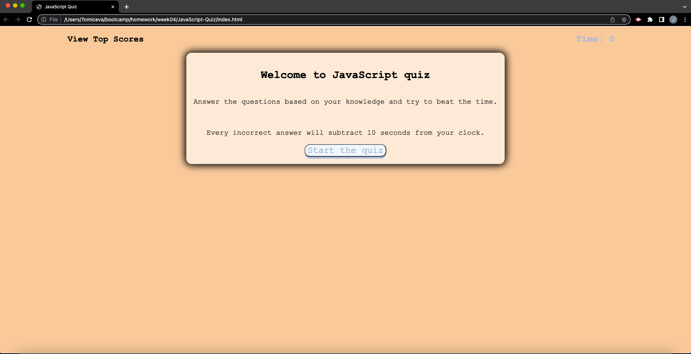
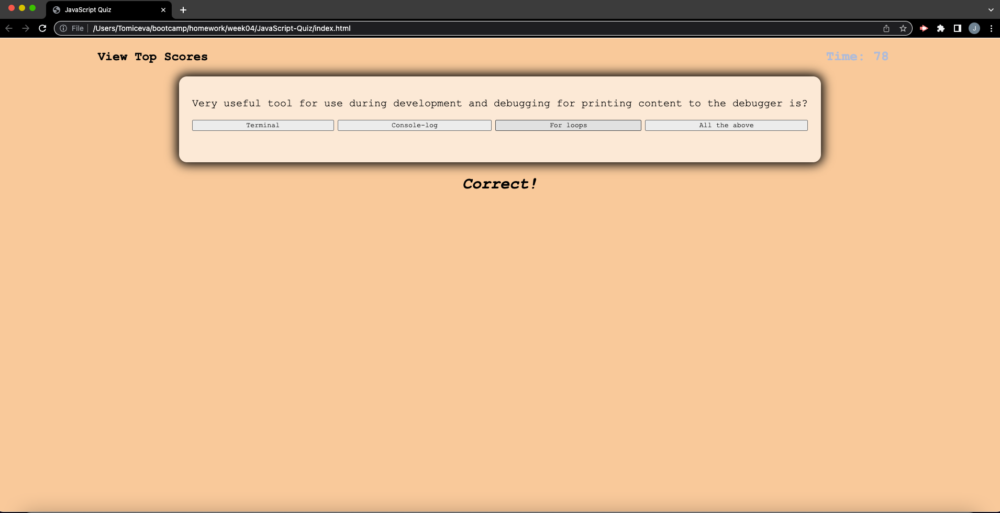
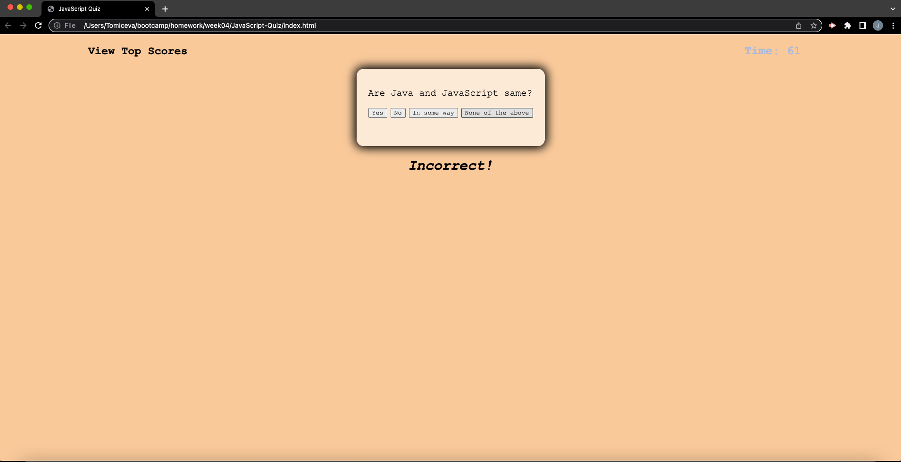
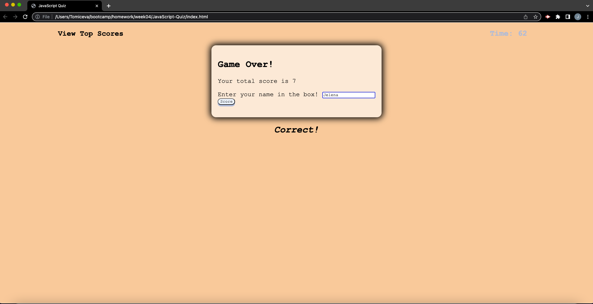

# JavaScript-Quiz

## Deployed application

    
## Description
This week's homework challenge was challenging to say the least. There was no starter code given, and we needed to show all the knowledge we have so far. We had to make a quiz with focus on java script.
It has to be a multiple choice option quiz with a time limit and every incorrect answer will deduct extra seconds from your clock.

## Installation
From Git Hub repository, first-portfolio, click CODE box, select SSH and copy the repository to your clipboard.  In your command-line navigate to the folder you want to hold the repository. 

## Usage
To get started press on button start the quiz :

Player will be presented with a question and four possible answers

When player select there answer it will be present with next question along with notification is previous answer correct or incorrect. If player select incorect answer 10 seconds will be deducted from the time left

When the time is up or there are no more questions Game over window will pop up with player score

Player has to write its name in the window and press score

When button score is pressed window TopScore will be presented and player have a choice to start over or to clear the score list.

## Credits
Google and youtube :
https://www.sitepoint.com/simple-javascript-quiz/
 
https://www.geeksforgeeks.org/how-to-create-a-simple-javascript-quiz/
 
https://www.youtube.com/watch?v=TT7ufOKX-U4
 
https://www.youtube.com/watch?v=riDzcEQbX6k

Special credits goes to Erik from AskBCS Learning Assistant who helped me find my typo mistake (and maintain my sanity at that point)
